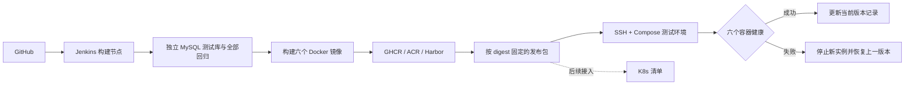

# 单服务器 CI/CD：GitHub、Jenkins、Docker，及后续 K8s

当前三进程服务器使用 `scripts/server/connect-core-jenkins.py --install` 接入已有 Jenkins，发布入口为 `Jenkinsfile.core` 和 `scripts/jenkins/{identity,business,gateway,all}.sh`。下面的旧 `Jenkinsfile` 是六服务部署通道。

## 当前结论

当前工程为 `TradePass-new/sqt-backend`，需要为它配置独立的 Git 远程仓库及 CI。Jenkins 的 `IMAGE_PREFIX` 发布参数留空，发布前填写本项目的 GHCR/ACR/Harbor 前缀；GitHub Actions 使用实际仓库名称生成 GHCR 前缀。本次没有创建远程仓库、镜像包或执行服务器部署。

本阶段先使用 Docker Compose 发布测试环境。K8s 清单可从同一份发布记录生成，等集群就绪后再接入。单台服务器使用 K8s 也不等于具备机器级高可用。

| 项目 | 当前状态 |
| --- | --- |
| 五个业务进程、Gateway、原业务回归 | 已有；源码已迁入各服务，服务直接位于根目录，见 [微服务架构](microservice-architecture.md) |
| Jenkins 持续集成 | 已提供 `Jenkinsfile` 和自动隔离测试库脚本 |
| 镜像构建、推送、版本追溯 | 六个镜像按 Git commit + 构建号打标签，发布使用 SHA256 digest |
| 单服务器发布与回滚 | 已提供 SSH 上传、健康检查、发布锁、失败恢复、手动回滚 |
| K8s | 已提供 Deployment、Service、ConfigMap、探针、ServiceAccount、NetworkPolicy 和 Ingress 示例；未安装集群 |
| 你的服务器接入 | 尚缺系统、CPU/内存、SSH 连接方式；没有远程安装或部署 |
| 正式上线 | 仍缺 OSS 适配验收、数据库迁移/备份、正式运行配置、域名 HTTPS、小程序切流和回滚验收 |



## 1. 服务器与构建节点

从空服务器开始可使用 [服务器初始化脚本与说明](server-bootstrap.md)：安装 Docker/Compose、MySQL/Redis，并选择 Jenkins、构建工具、监控及 Nginx。安装器自动识别 Ubuntu 22.04/24.04、Debian 12/13，其他系统停止提示。这里没有远程执行安装。Docker Engine 和 Compose 插件采用官方安装说明：[Ubuntu 安装指南](https://docs.docker.com/engine/install/ubuntu/)。

构建节点要求：

- Linux，本机 Docker daemon 和 Docker Compose V2（支持 `up --wait`、`--wait-timeout`）。CI 测试不支持把 `DOCKER_HOST` 指向另一台机器。
- Jenkins 控制器及 agent 使用受支持的 Java 版本；当前配置选择 JDK 21。**业务编译和集成测试仍使用 JDK 17**，二者分别配置。参见 [Jenkins Java 支持策略](https://www.jenkins.io/doc/book/platform-information/support-policy-java/)。
- Maven 3.9、Node.js 22、Python 3.9+、Git、SSH。Python 安装 `scripts/ci/requirements.txt`（PyYAML）。
- 构建节点与部署服务器 CPU 架构一致，当前镜像构建是单架构；跨架构发布需要另加 buildx 构建和目标架构测试。
- 同一台机器上同时运行 Jenkins、Maven、测试 MySQL、六个测试 JVM 和六个业务容器会争用资源。服务器配置尚未提供，资源分配须在接入时确认。

### Jenkins 控制器

如果使用上述初始化脚本，Jenkins 已由 `tradepass-infra` 项目管理，按初始化手册查看密码，**不要再创建下面这套控制器**。下面是未使用初始化脚本时的独立安装方式；准备好 Docker 后，在服务器仓库目录执行：

```bash
docker compose -f deploy/jenkins/compose.yml up -d
docker compose -f deploy/jenkins/compose.yml exec jenkins cat /var/jenkins_home/secrets/initialAdminPassword
```

界面只绑定服务器 `127.0.0.1:18080`。可先使用 SSH 隧道访问并完成初始化，后续给 Jenkins 配独立 HTTPS 域名以接收 GitHub webhook。初始密码只用于安装向导，不要提交到仓库。

这个控制器不挂载 Docker socket，也不负责执行构建。创建一个专门的 SSH agent，标签设为 `tradepass-ci`；可以暂时使用同一台宿主机的独立构建账号。控制器通过 SSH 连接宿主机时可使用 `host.docker.internal`，实际用户名、端口和主机指纹按服务器配置。

在 Jenkins 中：

1. 安装 `deploy/jenkins/plugins.txt` 列出的插件；控制器的内置节点执行器数量设为 0。
2. 配置 SSH 构建 agent，agent 启动 Java 为 JDK 21；构建工具 JDK 命名为 `tradepass-jdk17`，Maven 命名为 `tradepass-maven`。Node、Python、Docker 和 Git放入 agent 的 PATH。
3. 构建账号可执行 Docker。Docker 权限属于高权限；同主机不同账号主要隔离目录和凭据，不能视为强安全隔离。
4. 建立 GitHub **Multibranch Pipeline**，仓库为当前项目，脚本路径为 `Jenkinsfile`。只有 `main`/`master` 可以使用发布阶段。
5. 此带宿主机 Docker 权限的 Jenkins 作业只发现可信分支，**不要开启外部 fork PR 构建**。外部 PR 使用已有 GitHub Actions 的隔离 runner。发布目录和凭据限定在该项目的受控 Jenkins Folder 中。
6. GitHub webhook 指向 Jenkins HTTPS 地址的 `/github-webhook/`。没有 HTTPS 入口时，可先手动扫描分支并运行 `verify`。

相关机制参见 [Jenkins Pipeline 语法](https://www.jenkins.io/doc/book/pipeline/syntax/) 与 [Jenkinsfile 凭据用法](https://www.jenkins.io/doc/book/pipeline/jenkinsfile/)。

## 2. 凭据和镜像仓库

在 Jenkins 凭据管理中设置以下 ID，不把凭据内容写入 `Jenkinsfile`：

| ID | 类型 | 用途 |
| --- | --- | --- |
| GitHub Branch Source 中选择的凭据 | GitHub App / 仓库读取凭据 | 读取代码；在作业的 SCM 配置中选择 |
| `tradepass-registry-push` | Username with password | 镜像仓库用户名 + 推送 Token/密码 |
| `tradepass-staging-ssh` | SSH Username with private key | 登录测试服务器；参数 DEPLOY_USER 须与该账号一致 |
| `tradepass-staging-known-hosts` | Secret file | 已核验服务器公钥的 SSH known_hosts |

GHCR 的外部客户端使用 PAT classic，推送需要 `write:packages`；服务器只拉镜像时另用 `read:packages` 的凭据。权限及组织 SSO 按账号情况配置。参见 [GitHub Container registry 文档](https://docs.github.com/en/packages/working-with-a-github-packages-registry/working-with-the-container-registry)。

服务器部署账号应事先执行一次只读仓库登录，凭据保存在该账号的 Docker 配置中。Jenkins 的推送 Token 不会发送给应用容器。GHCR 在服务器所在网络无法访问时，可将 `IMAGE_PREFIX` 改成已有 ACR/Harbor 地址，同时替换仓库凭据；无需改业务代码。

SSH 使用 `StrictHostKeyChecking=yes`。从云厂商控制台或其他已信任途径核对主机指纹后再导入 `known_hosts`，不要将未经核验的扫描结果直接视为可信。

## 3. 准备测试环境目录和数据库

部署账号示例为 `tradepass-deploy`。管理员先创建该账号及其目录、配置 SSH 和 Docker 权限：

```text
/opt/tradepass/staging/
  .env                         服务器运行配置，权限 0600
  bin/compose_release.py       发布入口，由流水线更新
  releases/<commit>-<build>/   不可覆盖的历史发布包
  current                     当前健康版本
  previous                    上一个健康版本
  .publish.lock               防止并发发布
```

初始化脚本会首次生成这份 `.env` 和容器内网连接，重复运行保留。手工安装时，将 `deploy/jenkins/server.env.example` 的内容作为模板，由管理员保存为服务器 `.env`。填写测试库、内部随机密钥、微信和第三方配置。内部密钥可用 `openssl rand -hex 32` 生成。服务器运行配置不由 Jenkins 打包上传，不会进入归档。

数据库必须提前完成当前 V36 迁移，并使用独立测试库及账号。**发布脚本不会创建、清空、自动迁移或回滚业务数据库**。真实数据迁移需要先备份、在测试库演练、核对签署状态/库存/对账，再决定正式切流。

当前初次部署走原 BLOB 测试兼容路径，`TRADEPASS_ENVIRONMENT=staging` 是明确环境标识。脚本拒绝把这套初始配置直接发布为 production，因为普通服务器的 OSS 适配及正式迁移验收还没有完成。

ID 配置要求：五个业务服务 worker-id 固定为 1–5；不同环境、旧单体和所有连接同库的其他进程必须使用不重复的 datacenter-id/worker-id 组合。当前不支持通过复制相同 worker-id 直接增加副本。

## 4. 怎样运行流水线

| ACTION | 执行内容 |
| --- | --- |
| `verify`（默认） | 完整回归 + 六个镜像构建，不使用发布凭据 |
| `publish` | 完整回归 + 构建 + 推送 + 归档发布包 |
| `deploy` | 完整回归 + 构建 + 推送 + SSH 发布测试环境 |
| `rollback` | 使用服务器已保存的发布包回滚，不重新构建镜像 |

默认 Push 触发验证；发布由选择 `deploy` 的构建触发，没有额外的流水线审批停顿。等服务器接入和测试环境验收后，可再将可信主分支作业的默认动作改成自动部署。

发布参数：

- `IMAGE_PREFIX`：默认 `ghcr.io/wuyinglong0813/tradepass`，将创建 identity/contract/trade/settlement/file/gateway 六个镜像名。
- `DEPLOY_HOST`、`DEPLOY_USER`、`DEPLOY_PORT`：测试服务器 SSH 地址。
- `DEPLOY_ROOT`：默认 `/opt/tradepass/staging`。
- `ROLLBACK_RELEASE`：回滚时留空使用 `previous`，也可指定服务器上已保存的 `完整commit-构建号`。

发布包包含 `release.json`、`compose.json`、`compose_release.py` 和 `kubernetes.json`。只有全部镜像推送并解析出 digest 后才生成发布包。源码工作区不干净时拒绝创建正式发布记录；当前这批改动需先提交并推送 GitHub，Jenkins 才能构建它们。

### 发布过程与停机边界

1. 校验配置，拉取全部新镜像；拉取失败不会停止当前服务。
2. 停止当前六个应用容器，最长等待 60 秒的优雅关闭。
3. 启动新版本，等待六个容器的 `/actuator/health/readiness` 全部健康。
4. 成功后更新 `current` 和 `previous`。
5. 失败时先停止所有新实例，再启动上一个发布包；首次部署没有旧版本时停止新容器并报告失败。

**这是有短暂停机的整组发布。** 原因是目前共享业务库且固定 worker-id，不应让同一服务的两个写入实例同时运行。零停机灰度、分布式 ID 租约及可兼容的逐服务升级属于后续工作。

自动回滚恢复镜像和 Compose 配置，不会逆转已提交的数据库事务、对象文件、服务器 `.env` 或第三方签署动作。如果回滚自身失败，任务继续以失败结束，需要人工恢复；不会把回滚失败伪装成发布成功。

不清理历史镜像和发布目录，不执行 `docker system prune`、`down --volumes` 或业务库清理。定期保留策略应在备份、回滚窗口确认后另外配置。

## 5. K8s 文件怎么使用

发布包的 `kubernetes.json` 与 Compose 使用同一组镜像 digest。它包含六个单副本 Deployment、六个 ClusterIP Service、按内容命名的 ConfigMap、无 API token 挂载的 ServiceAccount、健康探针和入站 NetworkPolicy。

需要先建立集群、命名空间、密钥和受维护的入口控制器：

```bash
# 所有 kubectl 命令都显式选择测试集群 context
kubectl --context YOUR_STAGING_CONTEXT apply -f deploy/k8s/namespace.yaml
# 在本地私密目录准备实际的 business.env、internal.env 和只读 registry Docker config
kubectl --context YOUR_STAGING_CONTEXT -n tradepass-staging create secret generic tradepass-business --from-env-file=/private/path/business.env
kubectl --context YOUR_STAGING_CONTEXT -n tradepass-staging create secret generic tradepass-internal --from-env-file=/private/path/internal.env
kubectl --context YOUR_STAGING_CONTEXT -n tradepass-staging create secret generic tradepass-registry --type=kubernetes.io/dockerconfigjson --from-file=.dockerconfigjson=/private/path/config.json
kubectl --context YOUR_STAGING_CONTEXT -n tradepass-staging apply --dry-run=server -f dist/release/kubernetes.json
```

`business.env` 可参考 `deploy/k8s/business.env.example`；`internal.env` 包含同环境的 `TRADEPASS_INTERNAL_KEY`。实际 Secret 文件保存在仓库之外。

当需要自定义 namespace 或 ID 数据中心时重新生成：

```bash
python3 scripts/ci/render_k8s.py --release dist/release/release.json --output dist/release/kubernetes.json --namespace tradepass-staging --datacenter-id 2
```

本阶段 Jenkins 的 CD **只连接 Compose**，不会调用 kubectl。K8s 清单只准备到可审阅、可做服务端 dry-run 的程度，尚未在你的集群应用。后续接入 K8s 发布作业时，同样需要先停止旧的整组写入实例、等待它们退出，再启动新版本，并保存和验证上一个发布包。

- 单副本 `Recreate` 用于避免正常 Deployment 更新时重叠运行同一 worker-id；它不能处理所有强删 Pod、节点失联或强制替换情况。不要开启 HPA、手动扩副本或将这套配置宣传为高可用。[Deployment 更新策略](https://kubernetes.io/docs/concepts/workloads/controllers/deployment/)。
- startup/liveness 检查进程状态，readiness 检查能否接流量；数据库暂时不可用不会通过 liveness 连锁重启应用。[K8s 探针文档](https://kubernetes.io/docs/tasks/configure-pod-container/configure-liveness-readiness-startup-probes/)。
- NetworkPolicy 需要 CNI 支持；模板允许 `monitoring` 命名空间访问管理端口、`ingress-system` 命名空间访问网关业务端口，必须按实际部署位置调整。
- `deploy/k8s/ingress.example.yaml` 的域名、TLS Secret 和入口类是占位值，不会自动发布；入口只指向网关业务端口。
- Prometheus 抓取注解已提供，监控平台和发现规则需在集群另行安装配置；这里没有自动安装集群监控或通知渠道。

## 6. 验证及当前限制

本机可执行：

```bash
python3 -m unittest discover -s scripts/ci/tests -v
bash scripts/ci/verify.sh
```

`verify.sh` 自动创建本地 MySQL 临时容器和两个测试库，执行全部后端及服务测试、发布逻辑测试、Compose 校验和告警规则测试，最后移除自己创建的测试容器与数据卷。业务单测分布在各 `*-server` 与 framework starter；架构/MySQL 集成在 `deploy/integration-tests`；六进程回归在 `deploy/smoke-tests`；汇总覆盖率需另跑 `mvn -Pcoverage verify`，报告在 `deploy/coverage/target/site/jacoco-aggregate/`。此脚本要求本机 Docker，不使用服务器业务库。

另有 `scripts/ci/compose_smoke.py`：要求显式提供以 `tradepass_fix_validation_` 开头的已迁移测试库，创建临时本地镜像仓库，真实启动六个容器，再让新版本故意健康失败，验证自动恢复旧版本。它不向 GHCR/外部仓库推送。参数见脚本开头及环境变量 `TRADEPASS_CD_TEST_DATABASE_URL`、`TRADEPASS_CD_TEST_DATABASE_USERNAME`、`TRADEPASS_CD_TEST_DATABASE_PASSWORD`。

Jenkinsfile 可做 Groovy 语法检查，但当前没有在你的 Jenkins 中运行，也没有验证服务器 SSH、仓库授权、集群 API 或域名证书。完成这些接入后才能称为服务器流水线联调通过。

### CI/CD 初次交付的本机验证记录

历史集成回归及待验收项目见 [微服务验证记录](server-microservices-verification.md)。以下为此前发布/回滚演练的记录。

- 新 CI 入口执行通过，自动创建并清理临时 MySQL：353 项后端/微服务测试全部通过，0 失败、0 跳过；小程序测试通过。
- 15 项发布逻辑测试通过，包含失败恢复、发布中断、配置污染防护和镜像摘要校验。
- Jenkinsfile 通过 Groovy 语法解析；K8s 清单通过离线 Kustomize 解析，生成 16 个资源。尚未进行真实 Jenkins Declarative 校验或 K8s 服务端 dry-run。
- 六个带健康检查的 Docker 镜像在临时本地仓库完成推送/拉取，首次部署全部健康。
- 故意使新版本网关健康检查失败后，发布器恢复旧版本；六个容器全部重新健康，网关受保护接口仍返回预期 401。
- 演练使用隔离测试数据库；测试容器和临时镜像仓库已清理。没有连接你的服务器、推送 GHCR 或修改业务 Java 方法。

### 正式上线前仍需完成

1. 服务器运行资源、账号及网络访问确认，安装 Docker/Jenkins，配置构建节点。
2. 代码读取、镜像推送/拉取、SSH 主机指纹和运行密钥接入。
3. 普通服务器 OSS 实现、历史附件和签名读取兼容，以及迁移验收。
4. 数据库备份恢复演练、迁移版本确认、库存/对账/签署回归。
5. 微信与法大大正式配置、API 域名 HTTPS、小程序合法域名和入口切换。
6. 监控运行、通知接收人、磁盘与备份保留策略、发布回滚演练。

分库、Nacos、RocketMQ、Sentinel、XXL-JOB、Seata、ELK 和 SkyWalking 属于后续架构工作；它们并不是先把这套测试环境 CI/CD 跑起来的前提。
