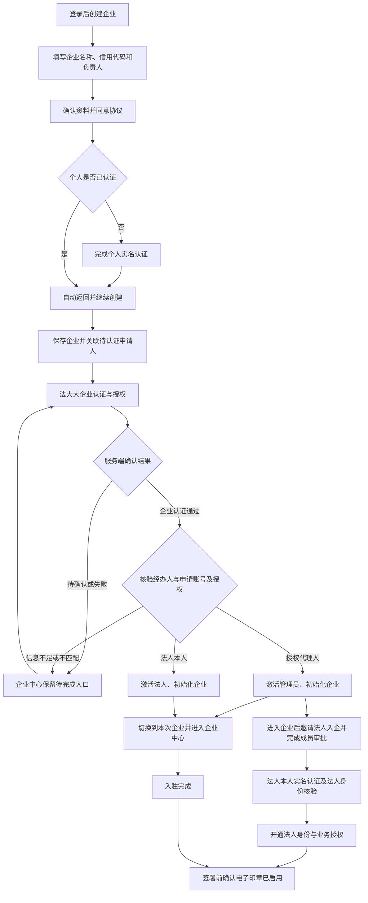

# 创建企业到认证完成

本文对应 2026-09-14 的本地修复。新流程需要后端和小程序一起发布；以下自动化验证使用接口替身，不代表线上法大大真机认证已经验收。

## 用户操作流程

1. **登录账号，点击「创建企业」。** 从首页或企业中心进入。
2. **填写企业资料。** 输入营业执照上的企业名称、统一社会信用代码（或工商注册号）、法定代表人/负责人姓名，进入企业信息确认页。
3. **确认资料并同意协议。** 勾选协议、点击「同意并开始认证」。确认页的资料按当前账号保存在本机，中途退出后可从企业中心继续。
4. **绑定手机号并核验个人身份。** 未绑定手机号的账号先在「我的 → 账号与个人信息」中使用微信手机号授权完成绑定；电脑微信用户使用同一微信账号在手机端继续。已完成个人实名认证则直接进入下一步；未完成则进入个人认证。认证成功后自动返回原企业创建流程，继续提交企业资料，不需要重新填写。
5. **保存企业并关联申请人。** 系统创建企业记录，把申请人关联为待认证申请人。此时不认定其为法人，也不开通业务权限，会显示在「待完成企业认证」中。
6. **办理企业认证。** 进入法大大页面，按页面要求完成企业主体核验和授权。第三方页面显示完成后，小程序通过回调和状态同步核对结果。
7. **确认认证结果并开通企业。** 服务端确认企业认证、授权和经办人身份后，法人本人开通法人身份，授权代理人开通管理员身份，并初始化企业角色和标准模板。小程序切换到本次认证的企业，保存当前企业信息，再进入企业中心。
8. **经办人创建的企业补齐法人身份。** 管理员通过「组织成员 → 邀请成员」邀请法人加入并审批，法人使用自己的已实名账号在「企业 → 法人身份核验」办理。服务端核验第三方返回的法人经办人类型和本人标识，成功后开通法人身份；企业已有其他法人时不通过这个入口直接更换。
9. **开通合作与业务权限。** 法人可发起或接受企业合作邀请，并为员工分配所需业务角色。经办人不自动取得法人或全部交易权限。
10. **企业入驻结束。** 首页、企业中心和「我的」能看到当前企业；如要进行电子签署，在「企业认证 → 电子印章」中确认印章已启用，并具备相应电子签授权。印章未启用时需先设置，再发起签署。已有印章的管理页不会因为检测到印章而自动退出。

**个人认证完成只代表个人身份核验通过；企业入驻完成以企业认证通过、成员身份激活和当前企业切换成功为准。**

## 中途退出与失败处理

| 情况 | 当前行为 | 继续方式 |
| --- | --- | --- |
| 个人认证取消或未完成 | 不创建企业，不自动反复打开认证；保留本机创建资料 | 企业中心点击创建资料继续 |
| 个人认证成功 | 自动返回企业创建流程，重新核验个人状态后继续提交 | 无需重复填写 |
| 企业已保存，关联请求断网 | 服务端保留企业，本机保存企业 ID | 企业中心恢复该企业，补完申请人关联后查询认证 |
| 企业认证页中途返回、退出小程序 | 已提交企业仍出现在待完成列表 | 点击对应企业继续认证或同步结果 |
| 第三方已完成，本地尚未确认 | 显示待确认，保留原企业 ID，不显示入驻成功 | 刷新认证结果或重新进入对应企业 |
| 企业认证失败 | 待完成列表显示认证未通过，认证页展示可用的失败原因 | 按原因处理后重新办理 |
| 已通过企业再次认证/授权失败 | 保留身份记录和失败原因，以服务端查询的最新认证结果恢复 | 后续核验通过可恢复企业状态，不因旧申请已通过而跳过恢复 |
| 企业认证通过但印章接口失败 | 企业与成员激活仍保存，单独提示印章暂未同步 | 稍后刷新印章或打开印章管理 |
| 认证已通过，但切换企业失败 | 保留结果与本次企业，不提前跳到空首页 | 重试切换；重新加载账号时也能读取已激活企业 |
| 认证状态接口不可用 | 显示状态待确认或加载失败，不把请求失败当作没有待认证企业 | 点击重试 |
| 已经有其他企业，另建一家 | 原企业权限继续按当前身份管理；新企业单独显示在待完成列表 | 新企业通过认证后切换到新企业并进入企业中心 |
| 更换账号 | 本机创建资料按用户 ID 隔离；服务端只查询本人创建的待认证企业 | 使用原账号继续 |

尚未提交到服务端的创建资料只保存在本机；清理小程序数据或更换设备后需要重新填写。已提交的待认证企业可随账号恢复。企业已经由他人入驻时，通过管理员邀请加入。

## 本次修复与验证

- 个人认证携带企业创建来源，成功后返回原创建页；页面栈丢失时回到账号对应的创建资料或明确的企业 ID。
- 企业中心提供本人待完成企业查询与恢复入口，覆盖企业提交后申请人关联中断的情况。
- 首页和「我的」显示待完成状态并提供企业中心入口；未认证企业不会因此获得正式企业权限。
- 企业创建成功后的继续流程不再依赖一次额外的用户资料刷新；认证返回发生在旧请求未结束时，会补做状态同步。
- 自动化覆盖个人认证成功续办、认证取消、账号隔离、关联断网恢复、大整数企业 ID、待完成提示、查询失败、旧请求竞争，以及原有认证成功切换和失败重试路径。

## 经办人身份与权限修正

- 经办人类型来自法大大 SDK 的 `CorpIdentityInfoRes.operatorType`：`legal_rep` 表示企业法定代表人，`deputy_auth` 表示授权代理人。不得用填写的法人姓名、姓名相同、某一种认证方式或企业认证通过来推断申请人是法人。
- 企业与认证详情须对应同一企业，认证状态须已通过，平台授权须完成且包含所需范围；认证返回的经办人标识须与申请账号已实名的法大大用户标识一致。信息缺失或不一致时保留待核验状态，不自动授予权限。真机验收需核对实际返回的经办人标识与本地实名账号标识，不能为让流程通过而放宽为姓名匹配。
- 法人本人使用 `LEGAL`，`is_legal_person=true`；授权代理人使用 `ADMIN`，`is_legal_person=false`、`is_administrator=true`。授予角色时同步重置角色集合并清除候选身份上的额外权限。管理员使用现有管理员权限，不获得 `all`，不获得仅法人可执行的操作权限。
- 管理员可通过企业管理权限查看和同步认证，通过印章管理权限进入印章管理；法人专属权限校验保持有效。签署等业务仍需对应的业务权限和服务商授权。
- 代理人企业提供受邀成员的法人补位入口。候选成员必须属于本企业且个人已实名，只有第三方核验为法人本人且经办人标识与本人实名账号一致时才能升级法人；不接受姓名匹配或仅勾选“我是法人”。已有其他法人时须另行办理法人变更。
- 企业资料中的法人姓名以通过核验的企业身份资料更新，后续合同 PDF 使用同步后的企业主表资料；不自动重写已经签署归档的合同。
- 认证激活与印章查询失败分开处理。印章暂时不可用不再回滚已确认的企业身份，并会展示可重试的印章同步提示。
- 旧认证审核回调只有“通过/驳回”，不足以确认经办人身份，正式环境不能再用它直接开通企业。正式开通统一经过法大大状态同步及经办人核验；本地显式开启的模拟认证保留测试用途。
- 发布包含数据库迁移 V32，保存认证服务返回的经办人类型和标识。迁移不批量修改历史成员角色；历史上已开通的法人身份须结合实际认证记录另行核验，本次不会用姓名推断并批量降权。

## 2026-09-26：认证回跳与结果确认

- 个人和企业授权请求均设置 URL 编码后的 `redirectMiniAppUrl`，指向非 tabBar 的 `pages/service-return/service-return`。个人成功回跳从当前会话的个人认证页恢复企业创建来源；企业回跳携带本次企业 ID。
- 服务商页面的“成功”或回跳参数不直接开通权限。结果页重新读取服务端状态；回调尚未到达且没有具体核验异常时，每 2.5 秒重试，最多等待 24 轮。离开页面暂停，账号切换或页面卸载后不会自动跳转。
- 本系统确认个人实名成功后显示“1 秒后继续企业开通”；企业及经办人核验通过、切换企业成功后显示“1 秒后自动进入企业中心”。其他业务结果页保留 5 秒。
- 企业核验返回具体异常时，认证承载页转到本系统结果页展示原因，不再一直停留在法大大页面。经办人标识缺失与不一致分别提示，均不自动授予企业权限。
- 官方企业身份接口示例的 `operatorId`、`operatorType` 是空串，参数表未说明这两个字段的标识域。SDK 有字段不代表每次一定返回，也不能由此断言 `operatorId` 必定等于 `openUserId`。当前仍保留既有严格校验；体验版“上海哦哦啊”的实际失败原因及正确映射，需取得服务商真实响应并核对，不能靠姓名匹配、直接改库或跳过权限校验解决。
- 本轮只修改本地源码；需同时发布 identity 后端和小程序，并做真机验收。自动化测试使用接口替身，不代表体验版认证已恢复。

官方依据（2026-09-26 查询）：

- [获取企业授权链接](https://cloud.fadada.com/api/edge-developer/document/nodes/CGKNKJZFM5/article?id=77KS5R59TERABQH9&version=5.1)：`redirectMiniAppUrl` 支持编码后的小程序原生页面路径，不支持 tabBar。
- [获取个人授权链接](https://cloud.fadada.com/api/edge-developer/document/nodes/ZS612WYE9M/article?id=IQDPQYVGZM2Y9OOC&version=5.1)：同样支持原生回跳路径。
- [查询企业认证身份信息](https://cloud.fadada.com/api/edge-developer/document/nodes/DVANAYXQIW/article?id=MDVIM0NPTTRSK2YI&version=5.1)：经办人字段在示例中为空，需核对实际响应。

### 录屏复现：个人授权成功后仍提示未查询到授权

2026-09-26 18:17 的录屏显示，法大大个人开通成功后已返回小程序，结果页却显示 `210022` 对应的“尚未查询到个人授权”，随后重新申请认证地址失败。原结果页只有 `failureReason` 为空才等待回调；个人状态接口会把暂时未查到授权和查询限流写入该字段，并缓存 30 秒，因而旧查询提示会立即终止等待。重复点击同步仍可能读取同一条缓存。

结果页现将这两种个人查询提示视为可重试状态，等待最多 24 轮，覆盖 30 秒查询冷却；后台确认成功后仍按 1 秒倒计时续办。等待耗尽只提示结果待同步；手动“重新同步”可重新开始等待。企业账号不匹配及明确的认证失败仍停止，不授予任何权限。

后续 identity 日志确认：18:17:36 的查询仍为 `210022`；18:17:56 至 18:17:58 的重新获取链接返回 `210002（该用户已授权，无需重复操作）`；18:18:01 返回 `100020（异常请求频繁）`。日志中没有 18:17:36 之后的个人状态查询，因此不能据此判断成功后持续查询不到用户或账号映射错误。

后端现保留获取个人链接时的 `210002`，以无链接加身份状态的响应引导结果同步；同步仍遵守查询冷却且以服务商身份状态为准，不直接标记实名成功。本地已通过的身份也不再重新申请授权链接。小程序识别个人接口的嵌套 `identity.status`，进入结果确认并等待，不将无链接显示成失败。并发回调已经确认成功时，不覆盖其状态。

本轮需更新 identity 服务和小程序。自动化覆盖已授权后核验通过、暂查不到账号、查询冷却、并发回调完成，以及前端嵌套身份状态与旧查询错误恢复；仍需真实环境复测。
