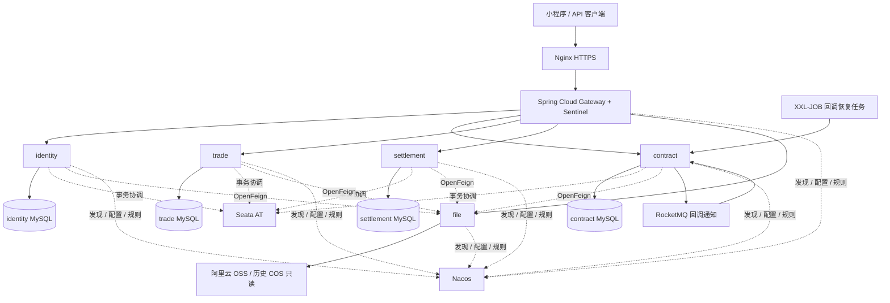

# 财源通天服务器微服务架构

采用用户指定的技术栈，合同、交易、结算分别部署并分库，通过分布式事务协作。原 152 条 HTTP 映射、请求响应、权限、金额和状态规则作为兼容约束。部署与迁移操作见 [分库切换说明](server-microservices-cutover.md)。

## 服务和表归属

服务目录、Maven artifactId、注册服务名和镜像名统一采用 `tradepass-<职责>`，使用小写字母与连字符。服务目录直接位于 `sqt-backend/` 根目录；内部的 `api`、`model`、`domain` 按层次组织，对应制品名为 `tradepass-<职责>-api/model/domain`。Java 包名继续使用合法的点分命名，如 `com.tradepass.module.contract`。

| 服务模块 | 业务范围 | 数据库 |
|---|---|---|
| tradepass-identity | 登录、用户、企业、成员、权限、实名认证、合作方 | 独立 identity 库，13 张业务表 |
| tradepass-contract | 合同、模板、签署、归档、法大大回调及恢复 | 独立 contract 库，8 张业务表 |
| tradepass-trade | 订单、履约、物流、仓库、库存、双边操作、项目台账、排行 | 独立 trade 库，20 张业务表 |
| tradepass-settlement | 附件、凭证、发票、对账分录、对账单 | 独立 settlement 库，3 张业务表 |
| tradepass-file | OSS 不可变对象写入、读取与历史 COS 读取 | 无数据库 |
| tradepass-gateway | 原 URL 入口、路由、外部身份头清理、限流 | 无数据库 |

公共与横切能力：`tradepass-framework/tradepass-common`、各 `tradepass-spring-boot-starter-*`。历史单体 SQL 在 `sql/mysql/`；分库工具在 `tools/database-migrator/`（非默认 reactor）；集成测试在 `deploy/integration-tests` 与 `deploy/smoke-tests`；覆盖率在 `deploy/coverage`（`mvn -Pcoverage verify`）。

各业务模块包分层对齐 yudao：

- `-api`：`api`（跨服务接口/DTO）、`enums`
- `-server`：`api`（门面 Impl）、`controller`、`convert`、`dal`（dataobject/mysql）、`framework`、`job`、`service`、`util`；启动类为 `*ServerApplication`，模块配置在 `framework.config`

领域测试在各 `*-server/src/test/java`。例如仅构建合同服务：`mvn -pl tradepass-module-contract -am -DskipTests package`。

每个业务库另外包含本域 audit_log、Seata undo_log 和 Flyway 历史表。精确清单在 `deploy/database/table-ownership.json`。独立服务 JAR 只包含自己的业务实现；API/模型用于显式的跨服务传输。

## 已落地的技术职责

| 技术 | 代码与配置 |
|---|---|
| Java / Spring Boot / MyBatis-Plus | 保留原框架基线和业务计算，服务只扫描本域 Mapper |
| Spring Cloud / Alibaba / Nacos | governance 模块、配置导入、注册发现和固定地址两种模式 |
| Gateway / OpenFeign / LoadBalancer | 原路径路由；domain-rpc 生成明确的请求记录与方法端点，不接受 SQL 或反射方法名；禁用透明写入重试 |
| Sentinel | 网关和 Feign 保护、Nacos 持久规则；限流和故障返回失败，不构造成功结果 |
| MySQL / Flyway | 四套独立基线（各服务 `db/owned/`）；历史 V1–V36 在 `sql/mysql/`；`tools/database-migrator` 离线复制与内容校验 |
| Seata | 原 Spring 事务跨服务协调、原回滚条件、MANDATORY 远程分支，以及独立创建意图的 REQUIRES_NEW 保留 |
| Redis | 原会话缓存、排行缓存、搜索限流和微信 token 缓存，保持显式配置开关 |
| OSS | 私有对象、加密、禁止覆盖、长度与摘要校验、历史 COS 只读凭据 |
| RocketMQ | 已持久化回调 ID 通知、消费重投；业务状态仍由原数据库事件处理器管理 |
| XXL-JOB | 调用原回调恢复器，自动初始化 30 秒调度任务；与本地调度互斥 |
| Docker / Kubernetes | 六服务镜像、Compose、StatefulSet、探针、私有服务和网关入口；固定角色/序号 ID 范围 |
| Prometheus / Grafana / Alertmanager | 私有指标端口、看板、告警规则与环境接收配置 |
| ELK + Filebeat | JSON 应用日志、按项目采集、私网管道和索引保留策略 |
| SkyWalking / Arthas | 镜像内置可启用的 Java agent、OAP/UI 部署、JDK attach 与按需诊断脚本 |
| CI / 镜像仓库 / Helm / Argo CD | GitHub Actions 和 Jenkins 入口；镜像摘要发布包、Helm chart、Argo CD 示例 |

## 事务与行为约束

收货记录、库存流水、库存余额与结算分录保持同一业务成功或失败结果。合同作废/恢复、付款凭证确认继续使用原权限、幂等和金额校验。法大大回调保留验签、持久去重、领取租约及失败恢复。

Seata AT 使用各库 undo_log 和协调器日志恢复。关键跨进程锁定操作需保持全局行锁；普通读的隔离特性与单库事务不同，因此并发与故障场景属于切流前验收内容。对象存储和法大大外部调用仍不属于数据库原子事务，原有不可变文件与创建意图恢复机制继续保留。

## 验证与切流

统一入口为 `bash scripts/ci/verify.sh`，启动隔离 MySQL、Seata 和 RocketMQ，覆盖原业务、实际六进程、迁移与受限数据库账号、消息和任务传输、跨服务异常与回滚及交付脚本。Nacos 模式单独运行同一批服务用例。正式服务器凭据、真实外部服务和生产切流不在本地测试中自动执行。

- [迁移、部署与完整配置](server-microservices-cutover.md)
- [Nacos 配置清单](../deploy/microservices/nacos/README.md)
- [服务器静态 Compose](../deploy/server/README.md)
- [Helm chart](../deploy/helm/tradepass)
